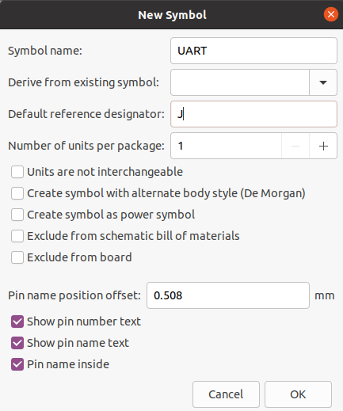
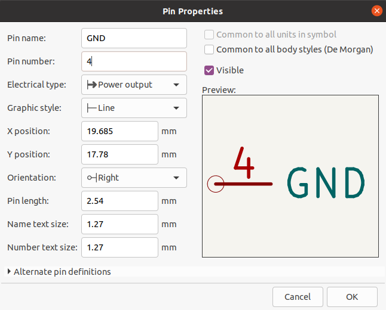
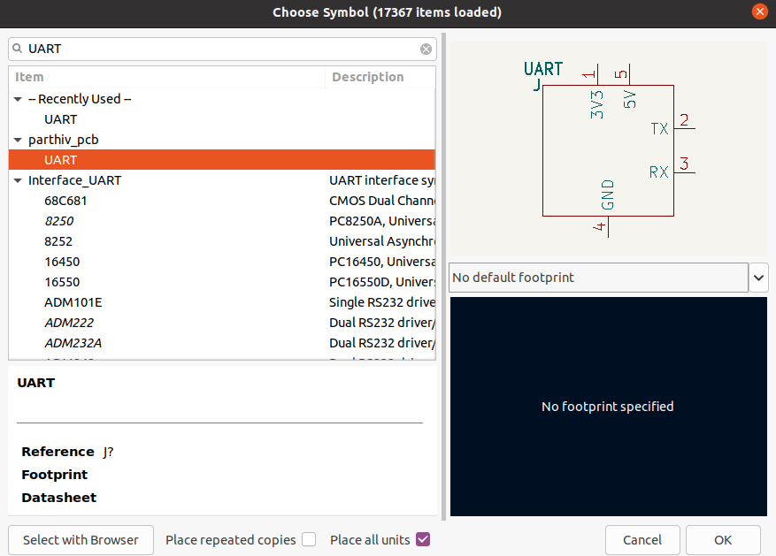
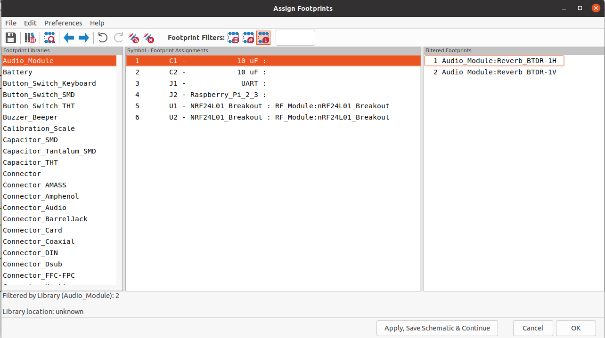
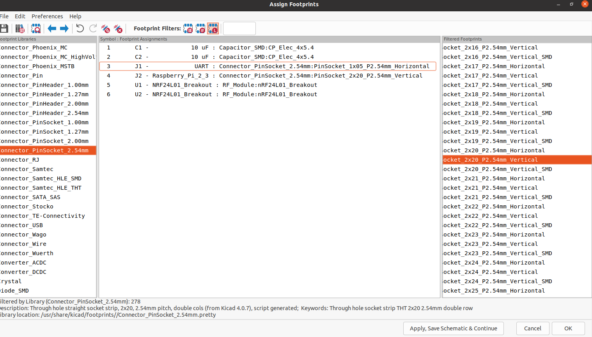

# PCB (KiCAD) Lab by Parthiv

This lab is focused on designing printed circuit boards (PCBs), which you may find useful in your final project. This is moreso a quick lesson on how to replace your bundles of wires with a more reliable board, rather than how to actually design electrical circuits on a board which is a much more involved discussion. 

Our goal is to create a board that can plug into the Raspberry Pi GPIO header and connect to the USB/UART converter and 2 NRFs. You can also optionally add other devices to the board of your choosing. My board looks something like this:

=
You can see the GPIO header on the bottom and various headers on the top to connect other devices.

A sample PCB project that contains the board above can be found in `parthiv_pcb/`. You can refer to this if you ever run into a wall for how to proceed.

## Step 0: Installation

Please follow the instructions at [https://www.kicad.org/download/](https://www.kicad.org/download/) for your OS. It is open source so it should be possible but potentially annoying to build if your OS isn't listed.

## Step 1: Creating a Project

1. Open up KiCAD (either type `kicad` in your terminal or search for it in your installed applications).
2. Go to File->New Project. Select a location where you want to create the project (you can do it in this directory) and give it a name. Ensure that the box to "Create a new folder for the project" is selected. Create the project.
3. You should see a window like this:

    

    On the left side, you can see a file called [project_name].kicad_pcb and another file called [project_name].kicad_sch. Double clicking these will open the PCB and Schematic editors respectively. 

## Step 2: Creating your Schematic

1. In the main KiCAD window, double click the .kicad_sch file to open the Schematic editor. You will see a blank schematic:

The schematic is where we will describe what pins of what components connect to what other pins of other components. You should try to keep it relatively organized if you can!

You can click and drag to move, or scroll up/down to zoom.

2. Go to Place->Add Symbol (or type the keyboard shortcut `A`). In the search bar, search for the symbol `Raspberry_Pi_2_3`. Select it, then click OK to start placing the component. Place it somewhere in the middle of the schematic by clicking. If you want to move it, you can click on it, hit `M`, and then move it around, then click again to place it. 

3. Now, we will connect the power rails of the Raspberry Pi. Hit `P` to open up the power symbol menu. Look for `GND` and hit OK to start placing the ground symbol. Put it near the bottom of the Raspberry Pi symbol. Hover over the end of one of the GND pins on the Pi, then hit `W` to start drawing a wire. Connect it to the GND symbol you just placed. Repeat this process for all the GND pins (see below).

Next, add power symbols for `+5V` and `+3V3` to the schematic, and connect those to the 5V and 3V3 pins of the Pi. Make sure you connect all pins of a given type together. We say 3V3 instead of 3.3V because in small text on a PCB, it may look like 33V. 3V3 is unambiguous.

4. Now that we've connected the power for the Pi, let's add some more components. Hit `A` again and find the `NRF24L01_Breakout` component, then place two of them. I would recommend putting them to the right of the Pi. Go ahead and connect the VCC to +3V3 and GND to GND.

5. Now, connect the NRF I/O pins to the Pi. For both NRFs, connect MOSI/MISO/SCK to the MOSI0/MISO0/SCK0 pins on the Pi. Also, connect the CSN of one to the Pi's CE0, and the CSN of the other to the Pi's CE1. Finally, connect the CE of each to two free GPIO pins (I chose 5 and 6). You can optionally also connect the IRQ pins to GPIO pins so you could have interrupt functionality, just make sure that each IRQ goes to a different GPIO.

6. The next step is to add a 10 uF coupling capacitor to each of the NRF power input pins to help smooth out the power supply to the NRF. Hit `A` and look for the `C_Polarized` part, and place one by each NRF. Connect the positive end of each to the NRF VCC, and the negative end to ground. Click on each capacitor and hit `E` to edit the properties. Set the value of each capacitor to `10 uF`. See the screenshot at the end of this section for what it should look like when you're done. 

7. Now, let's create a connector for our USB/UART chip so we can plug it directly into the PCB. We'll want to create a symbol to represent the logical pins that the USB/UART has. Go to Tools->Symbol Editor. You will see a blank symbol editor like this:

On the left, you can see various symbol libraries which contain different default parts that are common enough to be included in KiCAD. We will be creating a new one.

8. In the symbol editor, go to File->New Library. If you make it Project, any parts you make will only be usable in the current project. If you make it Global, you can use it in future projects. I went with Project but either is ok. Give it whatever name you want (`cs340lx_pcb`, or something)

9. On the left window, find the library you just created and right click on it. Then click New Symbol, and you'll see a window pop up. See below for recommended settings.

Click on OK and create it. 

10. On the very left (past the list of libraries), right click on the grid and select Grid Properties. 

In the window that shows up, change Current Grid to 2.54mm. This will prevent the weird alignment issues we had during lab.

11. On the right side, select the Draw a Rectangle tool and draw a rectangle on the screen. Don't worry, you can change it later. If you want to move the auto-generated text (`UART` and `J`), you can click on it (press escape to reach select mode like in the schematic editor) and hit `M` to move it. Click to place.

12. Now, we will add the pins. Hit `P` to create a pin. We'll make the `GND` pin, which is pin number 4 (4th from the top of the UART) and is a Power Output.

Place the pin down at the bottom of the rectangle, ensuring that the circle end of the pin is facing out (this is where you'll connect wires in the schematic).

13. Create the remaining 4 pins:

- 1: 3V3, power output
- 2: TX, output
- 3: RX, input
- 4: GND, power output (already did in step 11)
- 5: 5V, power output

Try to keep voltage at the top, ground at the bottom, and signals on the sides (like the Raspberry Pi symbol). You can grow and shrink the rectangle if needed by going to the select tool (escape). Your symbol should look something like this (doesn't have to match exactly). You can rotate a pin with `R` and move with `M` like you'd expect.

14. Once you've finished the UART symbol, save with Ctrl-S or Command-S, then exit the symbol editor. In the schematic editor, click `A` to add a symbol. Search for the UART you just created; you should see it pop up.

Connect the 5V pin to your +5V rail, GND to GND, TX to the Pi RX and RX to the Pi TX. You can optionally connect 3V3 to +3V3, but this isn't strictly necessary since the Pi also creates its own 3V3 on the pins.

15. Hover over an unused pin on the Pi and hit `Q` to mark it as a No-Connect (looks like an X). This declares that you meant to not connect this pin and didn't just forget to connect it. Now, you're in no-connect placing mode and you can click on all the unused pins on the Pi/UART/NRFs. Compare your schematic against the Completed Schematic section below, making sure that everything is connected the way it should be.

16. At this point, you are almost ready to edit the PCB. Here is the easiest point to go ahead and add more parts to your schematic; for example, if you want to add more sensors/devices. Make sure that when you create symbols, you assign pin numbers correctly so that it makes later steps easier.

17. Annotate the schematic with `Tools->Annotate Schematic`. A window will pop up, click Annotate, which assigns reference designators (`C1`, `J2`, etc) to all the symbols. 

18. Now, go to `Inspect->Electrical Rules Checker` and click Run ERC to run the ERC. Make sure you annotate the schematic first (step 17); otherwise, you get a ton of weird errors. This is like the compiler in software; it will catch violations of electrical rules (syntax) but NOT correctness. And sometimes it gets things wrong, which you will see.

You will hopefully see 2-3 errors. If you connected the UART 3V3 to +3V3, you will not get the first error I have. This error is because whoever made the Raspberry Pi Symbol decided to make the 3V3 pin a power input even though it's a power output. So the ERC thinks nobody is providing power to +3V3. We know this to be wrong (the Pi outputs 3V3) so we can ignore this.

The other error, saying that two outputs (both MISOs) are connected, can also be ignored. It is true that both NRFs output to their MISO pins, but semantically we know that only one will be doing so at a time (when its CSN is low).

If you have other errors, address them and re-run ERC. A common error is forgetting to put a no-connect on a pin in step 15.

19. The last step is to assign footprints, which are the representation of each symbol in the real world PCB. Go to `Tools->Assign Footprints`, which will open a new window. 

You will see that 2 of the 6 components (the NRFs) have footprints already assigned. We need to assign footprints for the other 4. Click on the row with C1, then on the left side look for library `Capacitor_SMD` (capacitor, surface mount device). On the right side, look for footprint `Capacitor_SMD:CP_Elec_4x5.4`. This corresponds to a capacitor with diameter 4mm and length 5.4mm, which is the size of [this 10uF capacitor](https://jlcpcb.com/partdetail/HonorElec-RVT1E100M0405/C3343) from the manufacturer we will use to assemble our boards (JLCPCB). Double click on `Capacitor_SMD:CP_Elec_4x5.4`, which will assign that footprint to our capacitor.

20. Go through and do this for all the components:

- Both capacitors: `Capacitor_SMD:CP_Elec_4x5.4`
- Pi: Library `Connector_PinSocket_2.54mm`, footprint `Connector_PinSocket_2.54mm:PinSocket_2x20_P2.54mm_Vertical` (0.1" female header, 2x20)
- UART: Library `Connector_PinSocket_2.54mm`, footprint `Connector_PinSocket_2.54mm:PinSocket_1x05_P2.54mm_Horizontal` (0.1" female 90 degree heder, 1x5).

Make sure it matches below.

### Completed Schematic

When you're done, your schematic should look something like this:

### Schematic Editor Keyboard Shortcuts

* `A`: add symbol
* `P`: add power symbol
* `Esc`: go to regular mouse (select) mode
* `M`: move (after selecting a symbol)
* `R`: rotate (after selecting a symbol)
* `E`: edit symbol properties (after selecting a symbol)
* `Q`: place no-connect symbol (should be in select mode first)
* `W`: draw wire (should be in select mode first)

### Schematic Editor Tools

* Tools->Symbol Editor: create new symbols
* Tools->Annotate Schematic: 

## Step 2: Create PCB

[https://github.com/Bouni/kicad-jlcpcb-tools](https://github.com/Bouni/kicad-jlcpcb-tools)